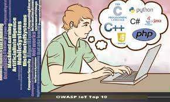

## Why computer science?

Why did I choose computer science as my major? Back in high school, my friend introduced me to a class where you could play games and chill. Most importantly, the grading was super easy. The title of the course is STEM. So, I took it during my junior year, and because I enjoyed it so much, I took it during my senior year too! I had developed a restaurant ordering page and personal gaming during the class. It is fun and chilling. I used my lunchtime to finish my project, and it was worth it. Once you complete the project before the due date, you could chill in the class by playing a game or doing homework for another type, which is fantastic. Also, the language I used was HTML. The enjoyable experience let me decide to take computer science as my major. 

## Experience with ES6.

For ES6, it is an excellent practice of polling out your knowledge of javaScript in your mind. The first couple of questions are easy and don't require that much thinking, but more toward the back, more time is needed. I don't know why that different level of ICS course, the language use is other, why not stick to one language. Although, different programming languages had parts in common and the same thinking mindset. To be honest, I forgot a lot of it. But, thank god, the ES6 and javascript practice in the freecodecamp are there.

## Programing with a template.

Programing with a template. I felt bad and ashamed when I did the in-class activities and the E07 and E08. I was so used to writing code for a project initiated with a template that you could use as a start. I FOUND IT DIFFICULT TO START when I encountered the in-class activities and the E07 and E08. E07 and E08, I used a lot of time to do it, and it's way over the DNF time. It is not a good sign for me, but I am willing to change it. 

## Conclusion

When we rely on others’ generosity and expertise to provide answers to our questions, it should hold that the question we ask should be one that leads to efficient and effective help that not only benefits us, but also the people we ask and others who might ask the same question in the future. Thus, if you have a question… make it a smart one! Asking questions may not always get you the best answer, but asking them in a way that will make others want to answer them will increase the success of finding a good solution and make it a positive experience on all sides.
