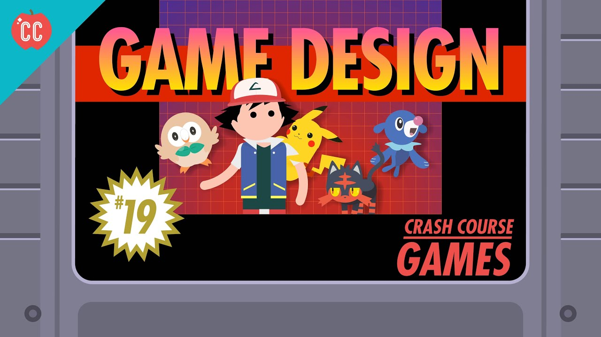

## Interested in Computer science.

If you ask me why I pick this major, the answer is simple I like playing the game. I want to develop my own game and publish it. My friend introduced me to the STEM class when I was in High school, and I love it. I played out the game he developed, and it's fun. The fact that the class's freeness and low-grade scale make it even better. After graduating high school and entering the real world, the fact that the income of a CS major is pretty high. So, why not CS as my major. 

--->Interest and money together! Also, why does everyone think those in CS major know how to fix computers physically. 

## Skills

To be honest, I am not should what kind of skill I have. It is random and not good at it. There are many languages out there, and I only know a few of them, and even the language I knew, the percentage of knowledge is low. Also, the fact that there is still more and more new language waiting to publish, master, or learn all of them is hard. But, this is the reason why I am here to learn. 

## Future

I hope to improve my programming skill and change my coding problems with a template. I forgot a lot of information about Javascript and hoping to improve it! Also, I will love to develop a game, website, etc., in the future and use those skills I learned to build a path to success. 
