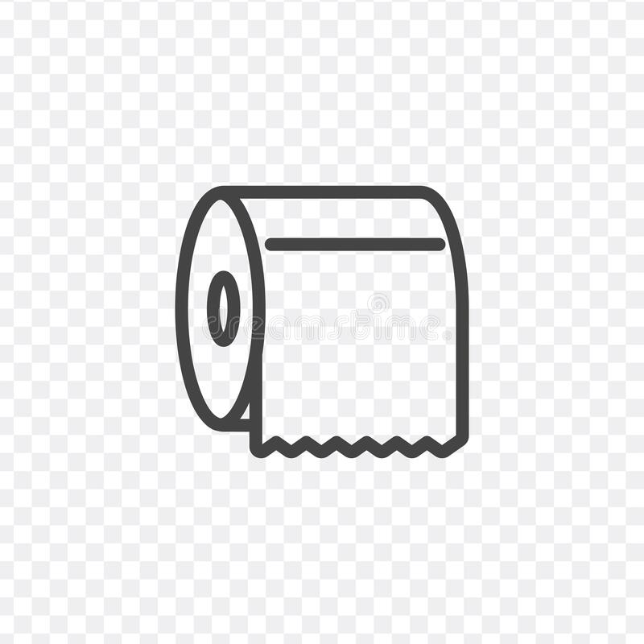

## Background of the Game.

The name of flappy, does it remind your guys of something? The game of flappy bird. The game has been super famous for a couple of years and has only been popular for a couple of months. For an unknown reason, the game disappears in any app store. During the time of popularities, I was a senior at Rosevelt High, and I was wondering what to do for my final project for my STEM class. The disappears of the game in the app store give me an idea of why not create a game similar to it, but a little different. 

## Rules.
The flappy toilet paper was created. The basic rule of the game is similar to the flappy bird, but additional rules were added. There will be random tiny water droplets that will drop toward you, and once they hit you, the paper is wet, you lose. The water droplets appear only on the front and top. 

It is not that easy to do the project. You had to cuts the image to the correct sizes and set the right width and height. The random function is required for the water droplets and the blocks. Also, background music and the sound effects of tapping. Also, the losing screen effects, etc...

## Learn.
It is a fun project to do. Although it was a personal project, we could play other classmates' games, and it was enjoyable. Also, it is fantastic to see how others develop its game and learn about the ideas they had. By the way, I can't believe I learned some photoshop while finishing project, reason why was that we need to shown images to its sizes that fully display without showing any background. 

## Sorry!!!!
Sorry, there is no link for this project. It was on my old GitHub acc linked with my high school Gmail. 

