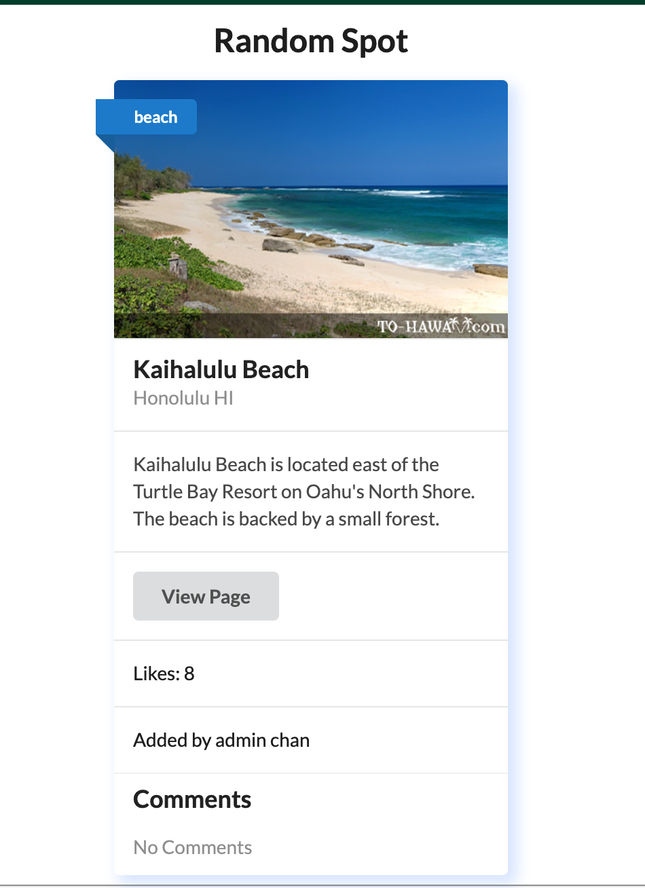
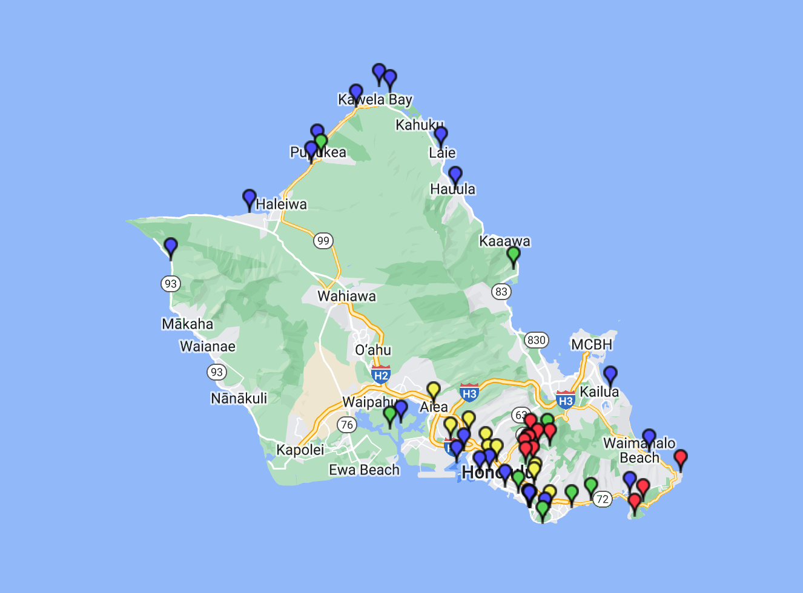
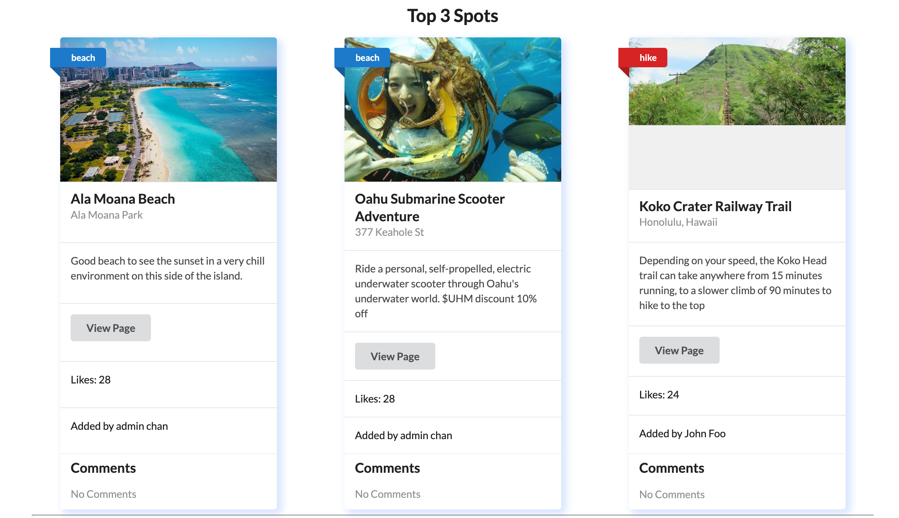
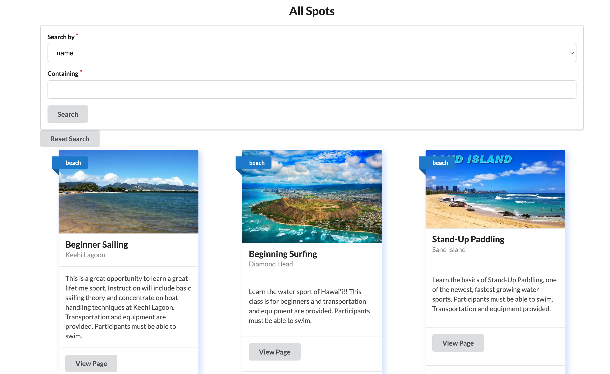

## Overview.

Walking with Pele is a web application that will provide a portal for students searching for spots for fun, studying, and relaxing in Oahu. The applications offer maps and images of the locations for view. It also includes three top most popular spots and a random spot page for students who had difficulty making a decision. This web application will enable students to find unique places on Oahu while also sharing their own for others to see. The application will build upon itself to provide amazing spots from the past to the present. 

## Roles & Thoughts 

Walking with Pele is our final project for ICS 314, and it is a group project. There are five people in the group. Each of us has a unique page or a function to implement. But the overall goal of all of us is to build a web application for students to enrich its life by visiting different unique spots on the beautiful island we live on and a break from all the school works. Especially summer is coming up. Back on track, my role in the project is to build a map and a random function. A map function includes the geographic locations on the google map. For random functions, it random a spot from a list of spots that I did the research on. Overall experience is pretty good. Except the map functions require some research on Google Maps react. The random function is covered in ICS314, so pretty simple to do. Also, I am the one who provides the default data of different spots. It's pretty chill and fun to research those data. Pictures down below is actual image of the website. 

## My Role

------------------------------------------------------------------------------------------------
## Overall 

------------------------------------------------------------------------------------------------
## Learning

This project is a fantastic assignment to refresh my memory of what I had learned in Ics 314. It means a review of Semantic UI React, CSS, HTML, etc... Almost all of the stuff we had going over in Ics 314. But, I am learning some new things, like the Google Map React. My role in the project is to provide an address of the spots and their geographic locations. It also includes a location on the actual google map. To do that, I have to do some research because it is a new topic I haven't learned. Besides that, this project is the first group project I have done since the COVID happens. It is nice and much easier to meet up in person to discuss the project and fix the bug we had. A long-distance meeting is not bad, but it is missing the sense of team works. 

## URL

The URL of this web application is a link to <a href="https://walking-with-pele.github.io/">GitHub</a>. You could clone it to your computer and run it. 
Besides that URL to the GitHub, you could also visit our web application through this HTTP link. It will be expired within a year, starting from April 2022. <a href="https://walking-with-pele.xyz/#/">Hurry</a>

